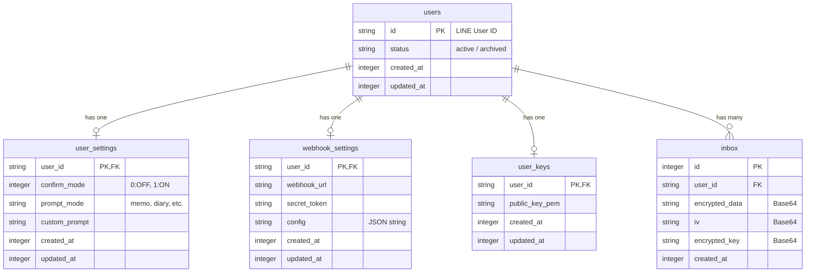

# データベース設計書

本プロジェクト「LINE Audio Summarizer」のデータベース構成です。
Cloudflare D1 (SQLite) を使用し、ORMには Drizzle を採用しています。

## ER図 (概念)

## テーブル定義

### 1. `users` (ユーザー台帳)

すべてのデータの親となるテーブルです。LINE User ID を主キーとして管理します。
このテーブルのレコードが削除されると、紐付くすべてのデータ（設定、Inbox等）が自動的に削除されます（Cascade Delete）。

| カラム名     | 型        | 制約                        | 説明                                                    |
| :----------- | :-------- | :-------------------------- | :------------------------------------------------------ |
| **`id`**     | `text`    | **Pk**                      | LINE User ID                                            |
| `status`     | `text`    | Not Null, Default: 'active' | ユーザーステータス ('active', 'archived', 'blocked' 等) |
| `created_at` | `integer` | Default: Current Timestamp  | 作成日時 (Unix Timestamp)                               |
| `updated_at` | `integer` | Default: Current Timestamp  | 更新日時 (Unix Timestamp)                               |

### 2. `user_settings` (ユーザー設定)

ユーザーごとのアプリケーション動作設定を管理します。

| カラム名        | 型        | 制約                    | 説明                                                               |
| :-------------- | :-------- | :---------------------- | :----------------------------------------------------------------- |
| **`user_id`**   | `text`    | **Pk, Fk** (`users.id`) | ユーザーID                                                         |
| `confirm_mode`  | `integer` | Default: 1              | 確認モード (0: OFF, 1: ON)                                         |
| `prompt_mode`   | `text`    | Default: 'memo'         | プロンプトモード ('memo', 'diary', 'todo', 'brainstorm', 'custom') |
| `custom_prompt` | `text`    | Nullable                | カスタムプロンプトの内容                                           |
| `created_at`    | `integer` |                         | 作成日時                                                           |
| `updated_at`    | `integer` |                         | 更新日時                                                           |

### 3. `webhook_settings` (連携設定)

Obsidianプラグインなどの外部連携用設定です。

| カラム名       | 型        | 制約                    | 説明                       |
| :------------- | :-------- | :---------------------- | :------------------------- |
| **`user_id`**  | `text`    | **Pk, Fk** (`users.id`) | ユーザーID                 |
| `webhook_url`  | `text`    | Not Null                | 通知送信先のWebhook URL    |
| `secret_token` | `text`    | Nullable                | 認証用シークレットトークン |
| `config`       | `text`    | Nullable                | その他設定 (JSON string)   |
| `created_at`   | `integer` |                         | 作成日時                   |
| `updated_at`   | `integer` |                         | 更新日時                   |

### 4. `user_keys` (暗号化鍵)

E2EE (End-to-End Encryption) 用の公開鍵を保持します。

| カラム名         | 型        | 制約                    | 説明             |
| :--------------- | :-------- | :---------------------- | :--------------- |
| **`user_id`**    | `text`    | **Pk, Fk** (`users.id`) | ユーザーID       |
| `public_key_pem` | `text`    | Not Null                | 公開鍵 (PEM形式) |
| `created_at`     | `integer` |                         | 作成日時         |
| `updated_at`     | `integer` |                         | 更新日時         |

### 5. `inbox` (メッセージ保管庫)

LINEから受け取った音声の要約結果などを一時保管する場所です。
データはクライアント側の公開鍵で暗号化されて保存されます。

| カラム名         | 型        | 制約                                 | 説明                               |
| :--------------- | :-------- | :----------------------------------- | :--------------------------------- |
| **`id`**         | `integer` | **Pk**, Auto Increment               | インボックスID                     |
| `user_id`        | `text`    | **Fk** (`users.id`), Not Null, Index | 所有ユーザーID                     |
| `encrypted_data` | `text`    | Not Null                             | AES暗号化された要約データ (Base64) |
| `iv`             | `text`    | Not Null                             | AES初期化ベクトル (Base64)         |
| `encrypted_key`  | `text`    | Not Null                             | RSA暗号化されたAES共通鍵 (Base64)  |
| `created_at`     | `integer` |                                      | 作成日時                           |
